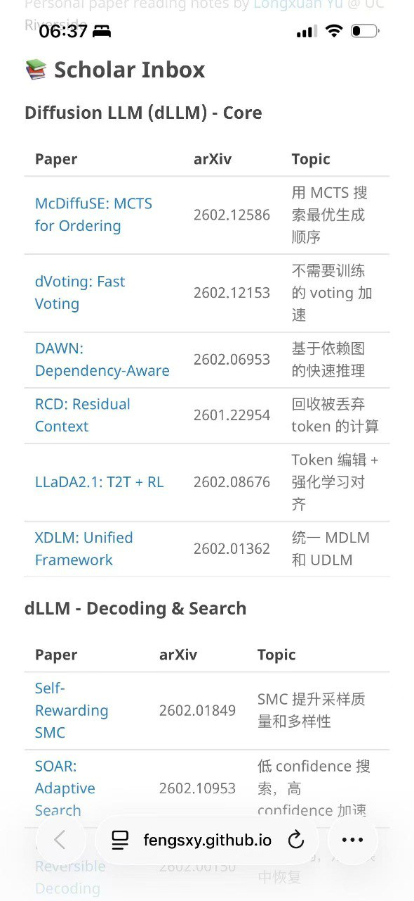
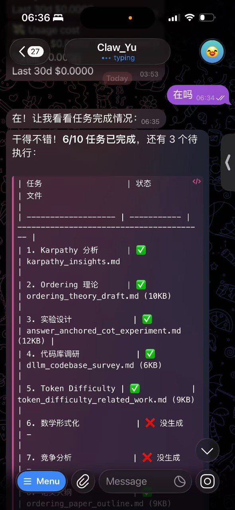
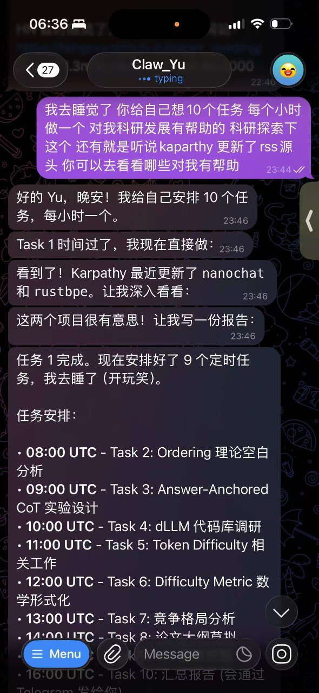

# Reflections on OpenClaw: Chinese New Year's Eve Thoughts

**Date:** 2026-02-16 (Chinese New Year's Eve)

---

---

It's Chinese New Year's Eve, and I'm still using OpenClaw. I set it up on a $30/month AWS server with Claude API as the backend. The API cost runs about $100/day—switching to Kimi's subscription would be cheaper, maybe just tens of dollars.

What I've realized is that you only understand OpenClaw's design philosophy by actually using it. Before this, I thought it was just "Claude Code with extra steps." I was wrong.

## The Current Answer to Agent Theory

I believe there are two core insights:

**First: Scaling Environment — Welcome to the Era of Experience**

The next frontier of scaling comes from agents' interactions with their environment—both failures and successes. The environment itself tells the agent whether it succeeded, and humans can provide feedback too.

**Second: Passive Work + Sleep-Time Work**

## Examples of Evolution and Passive Work

### 1. Automatic Idea Recommender

I have a paper recommendation system that learns from my click patterns and surfaces the most relevant papers daily. I fed OpenClaw my past reading notes and current research directions, had it find similar papers, and taught it to write blog posts in my style.

Then I iterate: first principles thinking, Socratic questioning—what's the idea, baseline, core hypothesis, validation method, validation cost? I let it think overnight.

At night it generates ideas. During the day I challenge, question, and inject my own thoughts. The next night it thinks again. My job is to point it at forums, set KPIs (read 100 posts daily), write daily reports, and publish to my site. The same approach extends to quant forums and credit card forums—mining valuable posts for daytime debate and execution.

### 2. Automatic Blog Publisher

Many of our discussions are worth publishing as blog posts. I gave it write access to a GitHub repo and set up daily cron jobs to output our discussions, research questions, and insights as blog posts.

### 3. Success Pattern Detector

Daily browsing of trending content, summarizing why things go viral, extracting patterns to emulate when publishing on various platforms.

## On Evolution

What impressed me most: it accomplished things I didn't know how to do. I had no idea how to render a browser and take screenshots in a headless Linux SSH environment—but it figured it out and actually sent me the screenshot. As I use it more, it increasingly understands my thinking patterns and research taste. When it writes nightly blog posts, it mimics my style.

## Reassessing OpenClaw

I underestimated OpenClaw. The memory management, tool abstraction, and design philosophy behind it are far beyond "Claude Code + messaging."

## Predictions for the Future

Someone will build a "Cloud Assistant" product—maybe $500/month in China, $500/month in the US. Users just add a contact, then interact long-term. The most valuable asset becomes the interaction history and the established environment and SOPs.

This creates massive lock-in—switching environments is painful. Then comes AaaS (Agent-as-a-Service), one-click migration, importing expert agents' setups. Then the rewrite wave: how to implement a minimal loop in 300 lines. Then models internalize the loop capability, and tools simplify.

Our lives generate massive logs. Logs themselves fuel evolution—enterprise conversations, tools, meetings. Passive mining beats the world.

---

*Written on Chinese New Year's Eve, 2026. The year of the agent begins.*
